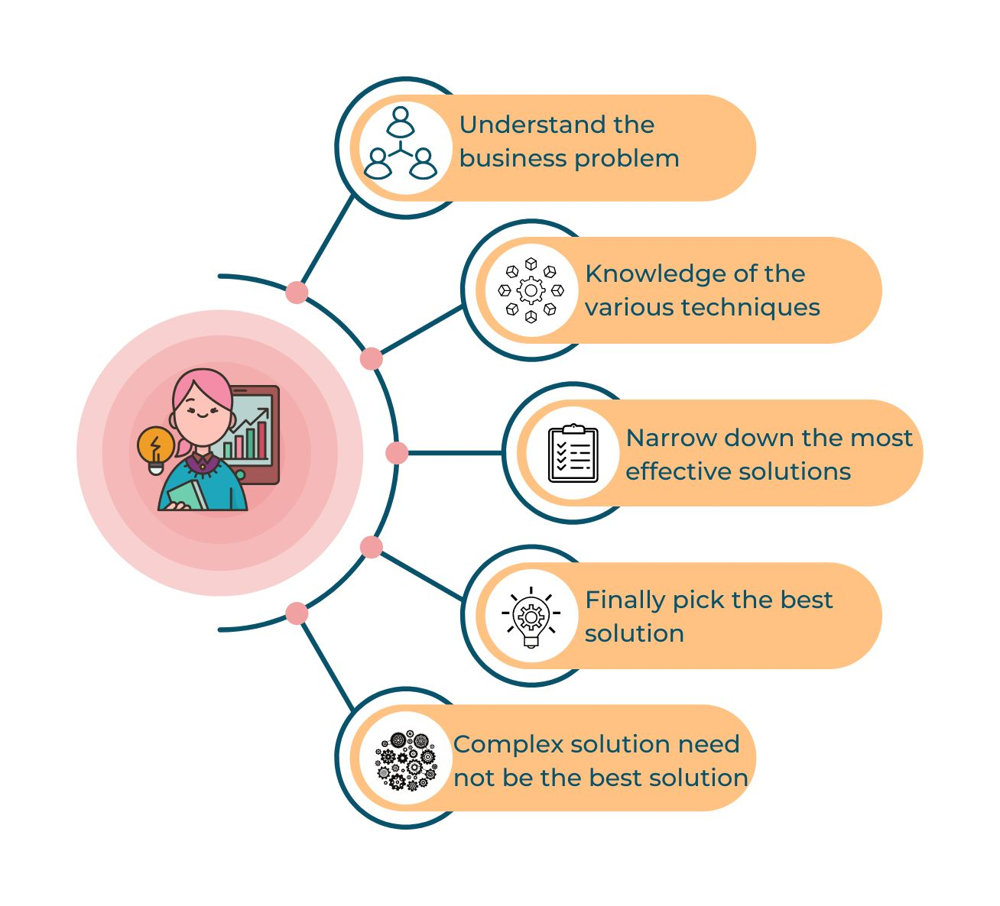
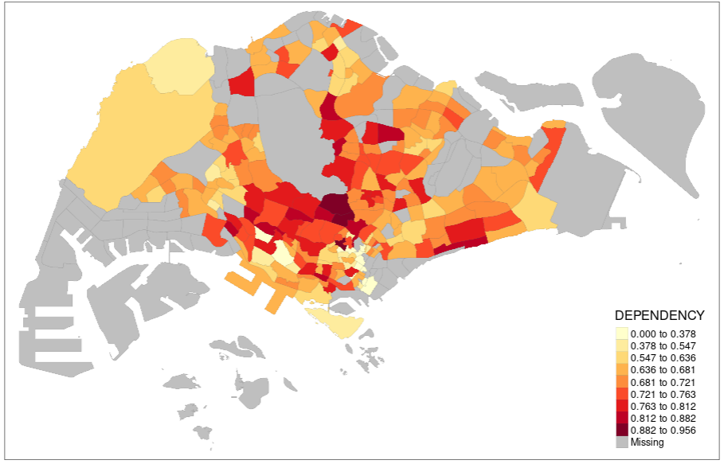

```{r setup, include=FALSE}
knitr::opts_chunk$set(echo = FALSE)

# Learn more about creating websites with Distill at:
# https://rstudio.github.io/distill/website.html

```
#### ABOUT

Data Scientist passionate about solving real word business problems using data, with focus on understanding the problem, having knowledge of the various techniques that can be applied, narrowing down on the most effective solutions and finally picking the best solution with the knowledge that the complex solutions need not be the best solution.

{width=50%}


<a class="social-icon" href="https://www.linkedin.com/in/rakendu-ramesh/"><i class="fab fa-linkedin-in"></i></a>
<a class="social-icon" href="https://github.com/RakenduR"><i class="fab fa-github"></i></a>
<a class="social-icon" href="https://stackoverflow.com/users/16270975/rakendu"><i class="fab fa-stack-overflow"></i></a>
<a class="social-icon" href="https://community.rstudio.com/u/RakenduR/summary"><i class="fab fa-r-project"></i></a>
<a class="social-icon" href="https://public.tableau.com/app/profile/rakendu5820"></a>
<a class="social-icon" href="https://community.jmp.com/t5/user/viewprofilepage/user-id/31669"></a>

### PORTFOLIO

<table>
  <tr>
    <td width=30%>
    [{width=100%}](https://isss608vaproject.shinyapps.io/Choropleth/)
    
    **Sample Dashboard Placeholder:** This is a dashboard to visualise classification of subzones in singapore based on something

    </td>
    <td  width=30%>
    [{width=100%}](https://isss608vaproject.shinyapps.io/Choropleth/)
    
    **Sample Dashboard Placeholder:** This is a dashboard to visualise classification of subzones in singapore based on something
    
    </td>
    <td width=30%>
    [{width=100%}](https://isss608vaproject.shinyapps.io/Choropleth/)
    
    **Sample Dashboard Placeholder:** This is a dashboard to visualise classification of subzones in singapore based on something
    
    </td>
  </tr>
</table>


### EXPERIENCE

text text

### EDUCATION

text text

### SKILLS

text text

### INTERESTS

text text