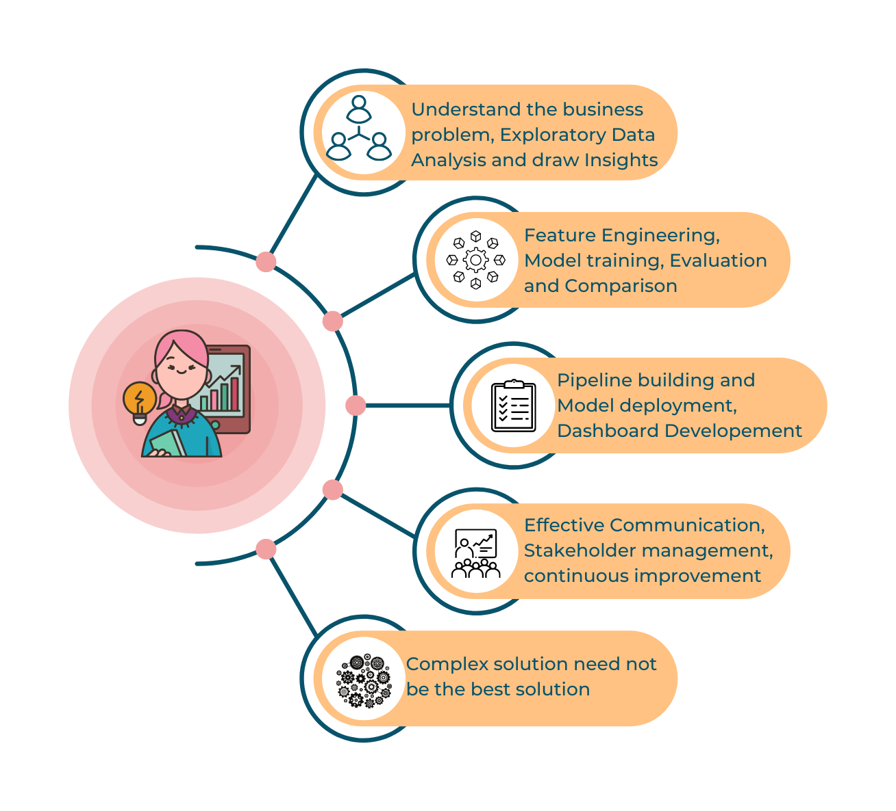

```{r setup, include=FALSE}
knitr::opts_chunk$set(echo = FALSE)

# Learn more about creating websites with Distill at:
# https://rstudio.github.io/distill/website.html

```
#### ABOUT

Data Analysis and Science Engineer passionate about solving real word business problems using data, with focus on 

* <b>Understanding the problem</b>
  * Key element of a data scientist's role is communication. Communication, not only with the stakeholders, but with every individual/team involved in the various stages of data lifecycle, starting from collection to maintenance, storage and archival. This is crucial to understand the data as well as patterns.

* <b>Knowledge of various techniques that can be applied</b>
  * In depth knowledge of various models like Linear and Logistic Regression, Naive Bayes, Decision Tree, Random Forest, Gradient Boosting, Deep Learning models like Convolutional and Recurrent Neural Networks.

* <b>Feature Engineering</b>
  * Often it is essential to derive features from existing data so that the model can train effectively. Various methods used for deriving new features include combining existing columns or using formulas from the relevant field.
  
* <b>Hyperparameter tuning</b>
  * Model performance can be enhanced further by choosing the right model parameters. Do we go for Entropy or Gini index? L1 or L2 regularization? These are decisions to be made based on improvement of the selected evaluation criteria.

* <b>Model Comparison</b>
  * Various measures are available to evaluate Machine Learning models. Which criteria to use among ROC AUC, Accuracy, Precision, Recall, etc and when is an important decision to be made.
  
* <b>Model Deployment and Dashboard Development</b>
  * Once the model and parameters are decided, it is crucial to retrain the model based on the important features, develop the data pipeline and deploy the model to be accessible from the dashboard for easy access by end user

* <b>Communication</b>
  * For effective Benefit realization, it is important that the analysis, insights and dashboard features are communicated to the business users. This includes user manual development as well as user training and support.
  
That is just a high level view of a Machine Learning Project lifecycle, head over to the blog for articles on each stage, where I continuously share details of my learning for future reference. Hope you enjoy it and find it useful. Feel free to ping me on [LinkedIn](https://www.linkedin.com/in/rakendu-ramesh/) if you would like to chat. Thanks!

{width=50%}


<a class="social-icon" href="https://www.linkedin.com/in/rakendu-ramesh/"><i class="fab fa-linkedin-in"></i></a>
<a class="social-icon" href="https://github.com/RakenduR"><i class="fab fa-github"></i></a>
<a class="social-icon" href="https://stackoverflow.com/users/16270975/rakendu"><i class="fab fa-stack-overflow"></i></a>
<a class="social-icon" href="https://community.rstudio.com/u/RakenduR/summary"><i class="fab fa-r-project"></i></a>
<a class="social-icon" href="https://public.tableau.com/app/profile/rakendu5820"></a>
<a class="social-icon" href="https://community.jmp.com/t5/user/viewprofilepage/user-id/31669"></a>

<!-- ### PORTFOLIO -->

<!-- <table> -->
<!--   <tr> -->
<!--     <td width=30%> -->
<!--     [{width=100%}](https://isss608vaproject.shinyapps.io/Choropleth/) -->

<!--     **Sample Dashboard Placeholder:** This is a dashboard to visualise classification of subzones in singapore based on something -->

<!--     </td> -->
<!--     <td  width=30%> -->
<!--     [{width=100%}](https://isss608vaproject.shinyapps.io/Choropleth/) -->

<!--     **Sample Dashboard Placeholder:** This is a dashboard to visualise classification of subzones in singapore based on something -->

<!--     </td> -->
<!--     <td width=30%> -->
<!--     [{width=100%}](https://isss608vaproject.shinyapps.io/Choropleth/) -->

<!--     **Sample Dashboard Placeholder:** This is a dashboard to visualise classification of subzones in singapore based on something -->

<!--     </td> -->
<!--   </tr> -->
<!-- </table> -->


